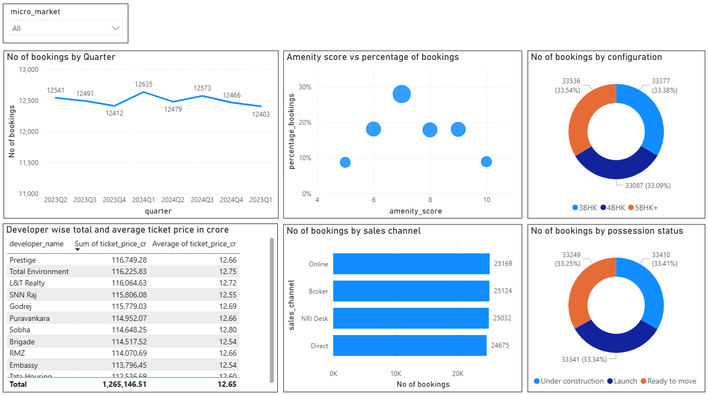

# luxury_housing_sales_analysis
## End-to-end luxury housing sales analysis project using Python, MySQL, and Power BI

## 📌 Project Overview
This project analyzes luxury housing bookings across Bangalore micro-markets using a cleaned real estate dataset. The goal was to derive actionable insights and visualize trends through an interactive Power BI dashboard.

## 🎯 Objectives
- Clean and standardize raw real estate transaction data
- Store cleaned data in MySQL for structured querying
- Connect MySQL to Power BI for dashboarding
- Analyze booking trends, buyer behavior, and market performance

## 🛠 Tools & Technologies
- Python (Pandas, NumPy)
- Jupyter Notebook
- MySQL
- Power BI
- GitHub

## 🧹 Data Cleaning Highlights
- Standardized categorical fields (micro-market, configuration)
- Converted monetary fields to numeric format
- Handled invalid unit sizes (-1) and missing values
- Created derived features (BHK count, year, quarter)

## 📊 Key Dashboard Insights
- Quarter-wise booking trends across micro-markets
- Amenity score vs booking success analysis
- Configuration-wise demand distribution
- Developer-wise pricing analysis
- Buyer type and possession status breakdown

## 📸 Dashboard Preview

## 📁 Repository Structure
- `data/` → Raw and cleaned datasets
- `notebooks/` → Data cleaning notebook
- `powerbi/` → Power BI dashboard file
- `images/` → Dashboard screenshots

## 🚀 How to Run
1. Run the Jupyter notebook to clean data
2. Load cleaned CSV into MySQL
3. Connect MySQL to Power BI using MySQL Connector/NET
4. Open `.pbix` file to explore the dashboard

## 📌 Author
Raju C
